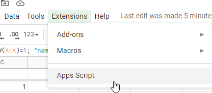
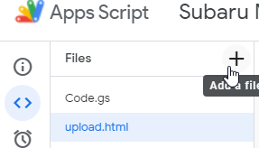
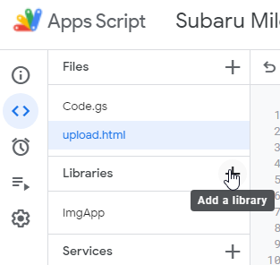
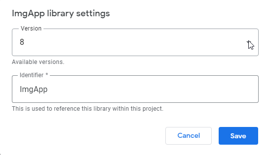
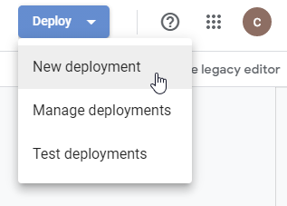
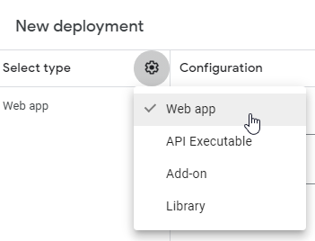
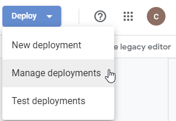
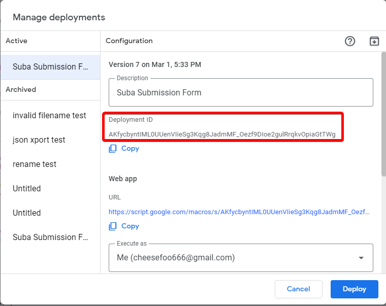
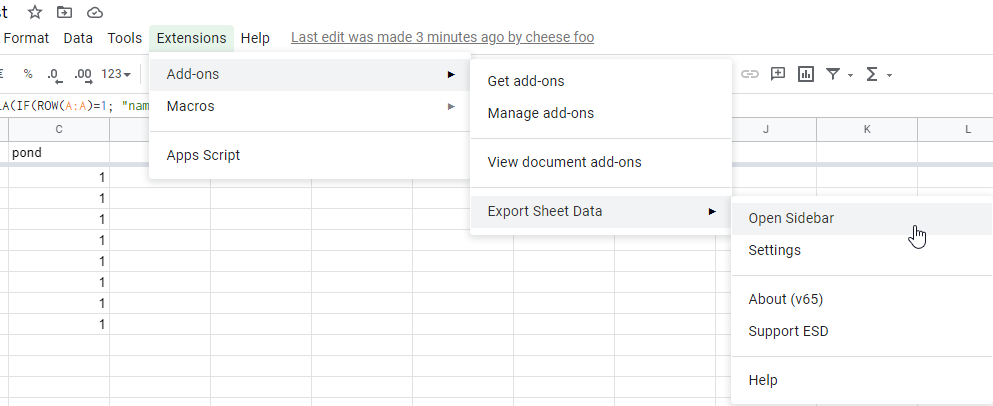
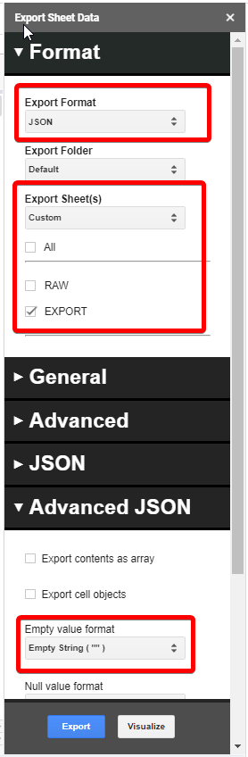

# Deployment instructions
1) Create or use existing google spreadsheet <br>
   <https://docs.google.com/spreadsheets/create?usp=drive_web>
2) Go to **Extensions -> Apps Script**, a new window should open
3) Create `code.js` and `upload.js` accordingly.<br>
   
   1) Add ImageApp library, id is `1T03nYHRho6XMWYcaumClcWr6ble65mAT8OLJqRFJ5lukPVogAN2NDl-y` <br>
      
   2) Make sure version is set to 8. <br>
4) Go to **Deploy -> New Deployment**. Set as Web App. <br> 
    <br> 
   1) You should see Deployment ID. Copy it<br>
   
5) In `upload.html` change the deployment id ###### to the one you just copied.
    ```
    <form action="https://script.google.com/macros/s/#####/exec"
   id="form" method="post">
   ```
6) Deploy again. Note that if any changes are made in code.js you need to re-deploy for the changes to reflect.

# Exporting
1) install this addon <br>
   https://workspace.google.com/marketplace/app/export_sheet_data/903838927001?pann=cwsdp&hl=en

2) **Extensions -> Add-ons -> Export Sheet Data -> Open Sidebar**

   
3) Verify that data in EXPORT sheet looks correct. It should auto-populate values as submissions come in but there may be errors.
4) Export the EXPORT sheet as JSON with null values set to empty string "".<br>
   
example<br>
<https://docs.google.com/spreadsheets/d/1EBwudic7TX1hittz1xoYEb-Ls_KrZsTD6GHpSy01XuA/edit?usp=sharing>


adapted from <br>
[ImgApp](https://github.com/tanaikech/ImgApp)
[Uploading Local Files to Google Drive without Authorization using HTML Form](https://gist.github.com/tanaikech/2f16f467c94612dc83920a3158614d95)