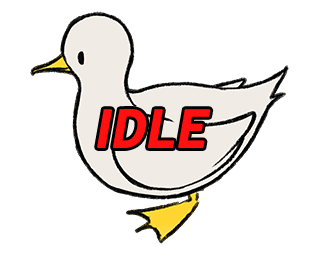
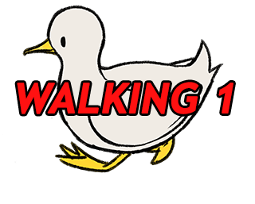
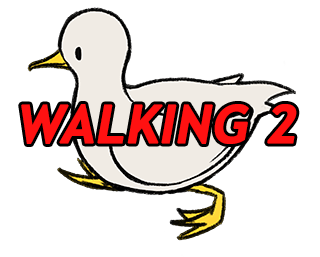
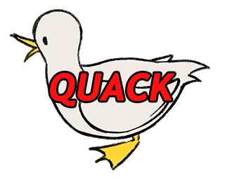
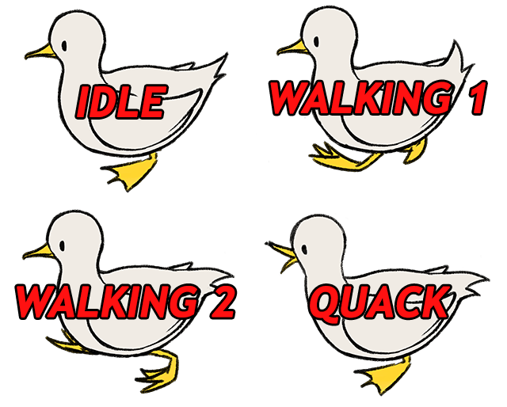
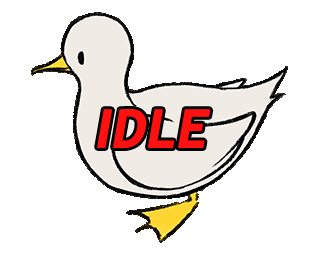

## Tutorial

Divided by level of knowledge
* [How do I participate?(and tl;dr)](#how-do-i-participate-tldr)
* [I don't know anything about anything](#how-do-you-create-an-animation)
* [I know a little about animation](#what-is-a-sprite-sheet)
* [I know about graphic design](#what-do-i-actually-do)
* [Uploading](#uploading)
* [FAQ](#faq)

//Going from baby knowledge -> expert knowledge
### How do I participate?
tl;dr: Go to __LINK TO SUBMISSION PAGE__ and submit us a __TOBEFINALIZED___  (4 frames, 100x100 each) png sprite sheet of a personalized duck, facing right, along with your name (optional). Be sure to follow the __LINK TO SUBMISSION GUIDELINES___. If the dimensions of your submission are wrong, you will be unable to submit it.

Draw an animated duck for Subaru! We are taking sprite sheet submissions. If you are interested please continue reading.
__maybe show internal example scene__

### How do you create an animation?
//kind of stolen from https://99designs.com/blog/video-animation/what-is-animation/

Animation is the capturing of sequential, static images—drawings or photos of objects—and playing them in rapid succession to mimic real world motion. If you’ve ever seen a flip book, you know how it works.

### What is a sprite sheet?
//kind of stolen from https://www.codeandweb.com/texturepacker/tutorials/how-to-create-a-sprite-sheet

A sprite sheet is one big image that contains all the animations of a character instead of dealing with many single files.
For your submission, you will be placing each animation frame next to each other. All frames have the same size, and the animation is aligned in each frame.

   

This is how the animation looks, at 10 frames per second.

### What do I actually do?
We have provided a template for you to draw over and personalize. You are free to not use it, but you must follow the __LINK TO SUBMISSION GUIDELINES__ and your resulting file must be a properly aligned __4__-frame spritesheet totalling __final dimensions etc__

![]SPRITESHEETTEMPLATE.PNG

If you do not have access to image editing software, you can use this website for free and import our template. The sprite is already divided into frames for you, and all you need to do when finished is export it as a spritesheet. https://www.piskelapp.com/
__LINK TO PISKEL FILE__
This video briefly goes over piskel's tools : https://youtu.be/tlpCU871Xyg

Of course, if you have your own preferred software, you are free to use it.

(will add more hand holding in response to feedback)

### Uploading
Upload here __link to submission site__

### FAQ
//placeholder

- ######*help im stuck*
ok go to discord maybe

- ######*why did u do this thingy this way*

idk lol

- ###### *can u add this feature*

prob not its too late
